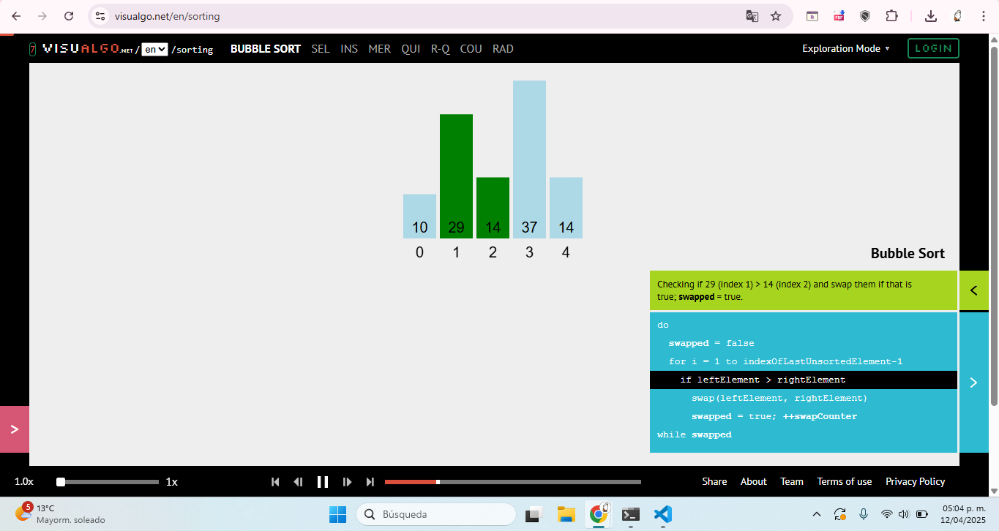

# AUXILIATURA PROGRAMACION 1 PARALELO C
--------
Auxiliatura de Programacion 1 - Paralelo C

## Metodos de ordenamientos vistos en la clase 12/04/2025
---
En esta clase se ve las matrices y metodos de ordenamiento
