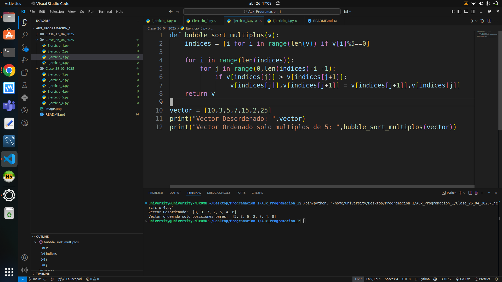
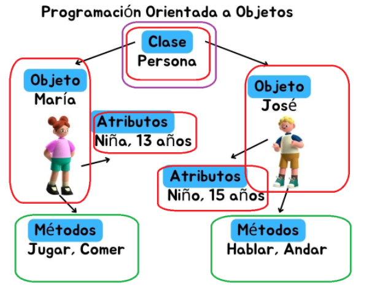

# AUXILIATURA PROGRAMACION 1 PARALELO C
--------
Auxiliatura de Programacion 1 - Paralelo C

## Metodos de ordenamientos vistos en la clase 12/04/2025
---
En esta clase se ve las matrices y metodos de ordenamiento

## Metodos de Ordenamiento bobble sort selecion sort insercion sort en la clase 26/04/2025

---

## introducion a la programacion orientada a objetos en la clase 07/06/2025

